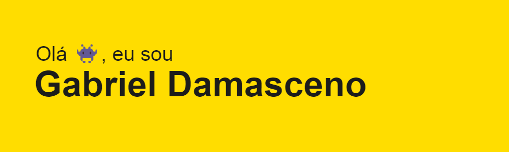

)

<h3>Sobre mim</h3>

- 📖 Atualmente faço curso técnico em Informática pelo Cefet-MG

- 🔭 Estou trabalhando em um projeto de extensão sobre o desenvolvimento de um sistema para gestão de propriedade intelectual

<h3 align="left">Linguagens</h3>

 
  
     
   
  
  
  

<!-- 

<!--
**GabrielAlvesDamasceno/GabrielAlvesDamasceno** is a ✨ _special_ ✨ repository because its `README.md` (this file) appears on your GitHub profile.

Here are some ideas to get you started:

-  I’m currently working on ...
- 🌱 I’m currently learning ...
- 👯 I’m looking to collaborate on ...
- 🤔 I’m looking for help with ...
- 💬 Ask me about ...
- 📫 How to reach me: ...
- 😄 Pronouns: ...
- ⚡ Fun fact: ...
-->
